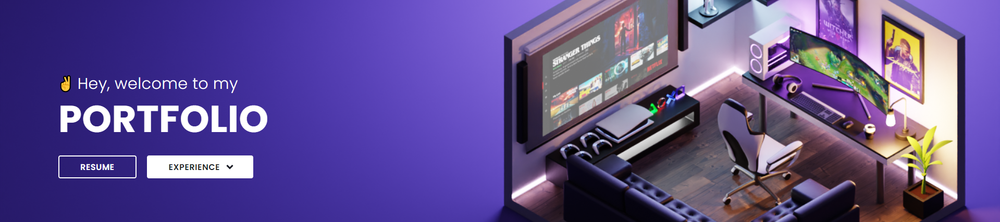

# ✌ Hey, welcome to my portfolio

 

## Technologies

Technologies and tools used in the development of the project:

- [Next.js](https://nextjs.org/)
- [TypeScript](https://www.typescriptlang.org/)
- [Chakra UI](https://chakra-ui.com/)
- [Prismic CMS](https://prismic.io/)
 

## Licença

 

---
Made with 💖 by [**mmarinhomac**](https://github.com/mmarinhomac)